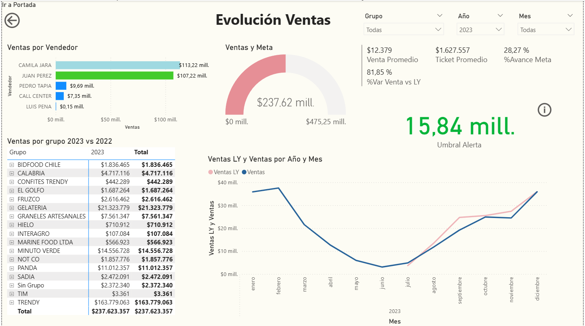
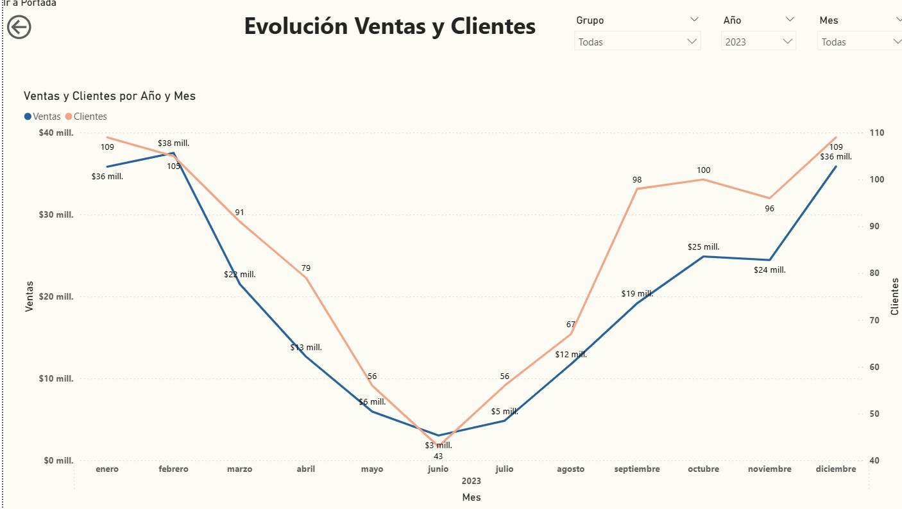
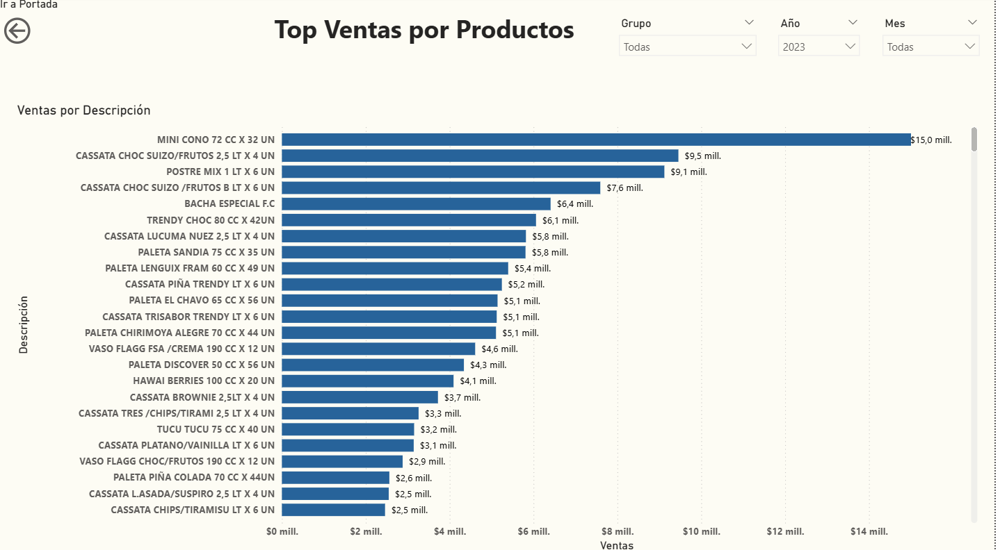

# Portfolio Data & BI Ventas de Productos Congelados

Bienvenido a mi Portafolio Personal en Power BI
Aquí encontrarás una colección de dashboards y proyectos desarrollados en Power BI que reflejan mis habilidades en visualización de datos, inteligencia de negocios y análisis orientado a la toma de decisiones. Este portafolio destaca especialmente un caso aplicado al rubro de alimentos congelados, optimizando el monitoreo y la evaluación de las ventas.

# About Me

Soy un profesional entusiasta de los datos, con experiencia en el desarrollo de soluciones de Business Intelligence usando Power BI. Me especializo en transformar datos en información estratégica, generando tableros visuales interactivos y comprensibles para equipos comerciales y ejecutivos.

Este sitio tiene como objetivo exhibir un portafolio de proyectos relacionados al análisis de datos y Business Intelligence.
-Contiene un proyecto del analisis de ventas en un negocio relacionado al retail y consumo masivo, con caracteriticas de indole temporal, productos, stock disponible, transacciones,
clientes, etc.
-Como herramientas se usan archivos csv de base con datos estructurados, Python para automatización y limpieza de los datos, POstgresSQL para estandarizar y almacenar los datos y Power BI para visualizar gráficamente y poder compartir esos datos transformandolos en información accionable y autoexplicativa.

# Proyecto 1: Dashboard de Ventas - Alimentos Congelados 

Este dashboard permite analizar el comportamiento de las ventas de productos congelados a lo largo del año, tanto a nivel general como por vendedor, grupo de productos y cliente. Además, se incluyen indicadores de cumplimiento de metas, ticket promedio y alertas en tiempo real.

Figura 1: Panel de resumen de ventas, metas y comparativa anual.

Figura 2: Evolución mensual de ventas vs número de clientes.

Figura 3: Ranking de productos más vendidos.

# Tecnologías Utilizadas
- Power BI (DAX, modelado de datos, diseño visual)
- Excel (fuentes de datos y limpieza previa)
- GitHub (repositorio del proyecto)
- Canva y Word (documentación y presentación del portafolio)

# Guía de Visualización del Proyecto

1. Descargar el archivo .pbix desde el repositorio de GitHub.
2. Abrirlo con Power BI Desktop (versión 2023 o superior).
3. Explorar cada página del informe: resumen general, comparativo anual, productos destacados.
4. Aplicar filtros por grupo, año o mes según sea necesario.

# Enlaces Relevantes
Repositorio en GitHub: [Agrega aquí tu enlace]
Proyecto alojado en GitHub Pages o Netlify: [Agrega aquí tu enlace]
Video Técnico en YouTube: [Agrega aquí tu enlace]

# Conclusión
Este proyecto demuestra la utilidad de Power BI para analizar y visualizar datos de ventas de productos congelados, permitiendo tomar decisiones basadas en datos reales. El uso de herramientas modernas y el enfoque orientado a negocio hacen de este dashboard una solución valiosa para áreas comerciales y de dirección.

